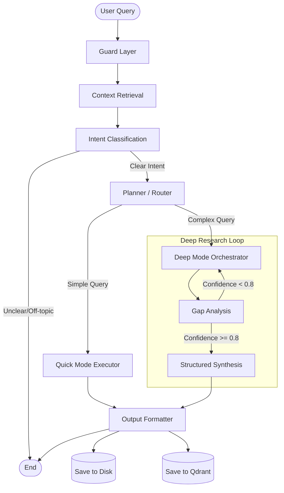

# Developer Research AI Agent

A robust, graph-based AI agent designed for deep technical research. It uses **LangGraph** for orchestration, **Ollama** for local LLM inference, **Qdrant** for persistent memory, and **DuckDuckGo/Tavily** for web search.

## 🚀 Features

- **Dual Mode Execution**:
  - **Quick Mode**: Direct LLM answers for simple queries.
  - **Deep Mode**: Iterative research loop with web search, gap analysis, and synthesis.
- **Persistent Memory**: Uses Qdrant to store user context and research history across sessions.
- **Guardrails**: Telemetry and budget tracking for query execution.
- **Intent Classification**: Automatically categorizes queries (Research, Bug Fix, Architecture, etc.).
- **Structured Output**: Generates detailed markdown reports saved to the `output/` directory.

## High-Level Data Flow

The system follows a multi-stage pipeline:
1.  **Ingestion & Guardrails**: Validates input and initializes state.
2.  **Contextualization**: Retrieves long-term memory.
3.  **Planning**: Determines intent and routing (Quick vs. Deep).
4.  **Execution**:
    -   *Quick Mode*: Immediate LLM response.
    -   *Deep Mode*: Iterative search and analysis loop.
5.  **Synthesis**: Compiles findings into a report.
6.  **Persistence**: Formats output and saves to disk/memory.

## Graph Diagram




## 📂 Project Structure

```bash
.
├── main.py                     # Entry point for the agent
├── config.py                   # Configuration settings (Model, API keys)
├── state.py                    # Graph state definition (TypedDict)
├── memory.py                   # Qdrant integration for persistent memory
├── graph/                      # Core logic nodes (LangGraph)
│   ├── nodes_pre.py            # Guard, Context, Intent Classification
│   ├── nodes_exec.py           # Planner, Quick/Deep Execution modes
│   ├── nodes_post.py           # Output formatting and saving
│   ├── builder.py              # Graph construction logic (optional refactor)
│   └── routes.py               # Conditional edge logic
├── output/                     # Generated markdown reports
├── qdrant_db/                  # Local Vector DB storage
├── tools/                      # External tool definitions
│   ├── search_tools.py
│   └── memory_tools.py
├── prompts/                    # LLM Prompt templates
├── test_research_agent.py      # End-to-end automated test script
├── test_memory.py              # Memory persistence test script
└── requirements.txt            # Python dependencies
```

## �📦 Installation

### Prerequisites
- Python 3.10+
- [Ollama](https://ollama.com/) running locally.
- Recommended Model: `ministral-3` (or configure your own in `config.py`).

### Setup

1.  **Clone the repository** (if applicable) or navigate to the project directory.

2.  **Create a Virtual Environment**:
    ```bash
    python3 -m venv .venv
    source .venv/bin/activate
    ```

3.  **Install Dependencies**:
    ```bash
    pip install -r requirements.txt
    ```

4.  **Environment Variables**:
    Create a `.env` file in the root directory:
    ```env
    # Optional: For better search results
    TAVILY_API_KEY=your_api_key_here
    ```

## 🏃 Usage

### Streamlit Web Interface (Recommended)
Launch the professional web interface:
```bash
streamlit run app.py
```
Features:
- 💬 Interactive chat interface
- 📊 Real-time progress tracking
- 🎯 Session history
- 📈 Token usage statistics
- 🎨 Responsive, professional design

### Interactive CLI Mode
Run the main script to start the interactive CL agent:
```bash
python main.py
```
Type your query when prompted. Type `exit` to quit.

### Automated Testing
Run the comprehensive test script to verify the full workflow:
```bash
python test_research_agent.py
```
This script runs a complex query ("Mamba vs Transformer") and asserts that all graph nodes execute correctly.

### Check Memory
Verify memory persistence:
```bash
python test_memory.py
```

## 📂 Output

- **Reports**: Saved as `research_report_YYYYMMDD_HHMMSS.md` in the `output/` directory.
- **Memory**: Stored locally in `qdrant_db/`.

## ⚙️ Configuration

Modify `config.py` to change:
-   `MODEL_NAME`: The Ollama model to use.
-   `MAX_ITERATIONS_DEEP_MODE`: Research depth.
-   `CONFIDENCE_THRESHOLD`: When to stop researching.

